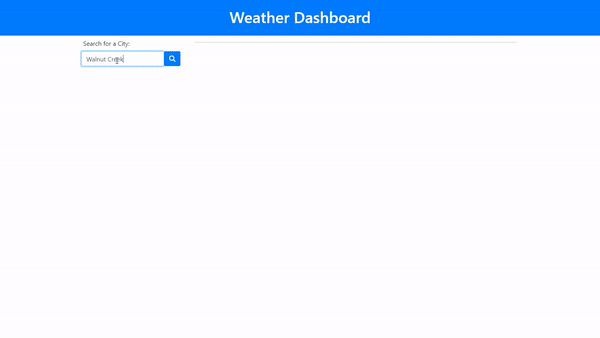

# Week06-Challenge (weather-dashboard)

## Description:

The purpose of this exercise is to build a dynamic weather dashboard which leverages on the OpenWeather API. The user will be able to enter a specific city into the search field which will display its current weather as well as the 5-day forecast.

`localStorage` will be used to store any persistent data. The user can reset the list of previously searched cities by clicking on the red "clear" button.

### GIF Animation:

### Links:

https://xvrteo.github.io/weather-dashboard

https://github.com/XvrTeo/weather-dashboard
